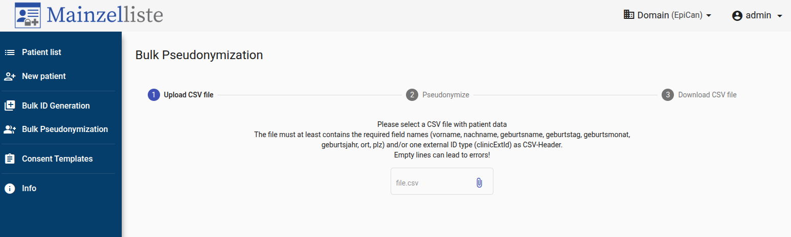

# ITCC PedCanPortal Mainzelliste Pseudonymization Guide

This guide explains how to access and use the centralized pseudonymization service (Mainzelliste) for generating unified ITCC sample IDs across the consortium.

## Table of Contents
- [Overview](#overview)
- [Prerequisites](#prerequisites)
- [Accessing the Mainzelliste Service](#accessing-the-mainzelliste-service)
- [Preparing Your Data](#preparing-your-data)
- [Generating ITCC Sample IDs](#generating-itcc-sample-ids)
- [Contact Information](#contact-information)

## Overview

The Mainzelliste service functions as a double pseudonym generator which enables secure data sharing across the ITCC consortium with a unified sample_id. This centralized approach ensures that all samples can be consistently identified across different datasets and institutions.

The service is based on:
- Backend: [Mainzelliste](https://bitbucket.org/medicalinformatics/mainzelliste/src/master/)
- Frontend: [Mainzelliste GUI](https://github.com/medicalinformatics/mainzelliste-gui/)

## Prerequisites

Before using the Mainzelliste service, ensure you have:

1. Completed all steps in the [main data upload guide](../README.md)
2. Received confirmation of access from the DKFZ team

## Accessing the Mainzelliste Service

The Mainzelliste service is now directly accessible at:
```
https://pseudonymization.pedcanportal.eu/
```

To access the service, simply open a browser and navigate to the URL above. You will need to log in with the credentials provided to you after requesting access.

## Preparing Your Data

To generate ITCC sample IDs, you need to prepare a CSV file with your local sample identifiers:

1. Create a CSV file with a single column named `clinicExtId`
2. Add your local sample IDs to this column
3. To avoid collisions with IDs from other institutions, prefix each local sample ID with your site ID

Example CSV format:
```
clinicExtId
SITE001-Sample1
SITE001-Sample2
SITE001-Sample3
```

**Important:** Using the site prefix is crucial to prevent ID collisions between different institutions.

## Generating ITCC Sample IDs

Once you have prepared your CSV file and accessed the Mainzelliste service:

1. Navigate to the "Bulk Pseudonymization" page at:
   ```
   https://pseudonymization.pedcanportal.eu/bulk-pseudonymization
   ```

2. Click on the "Choose File" button and select your prepared CSV file

3. Click on the "Pseudonymize" button to generate ITCC sample IDs

4. The system will process your file and generate unique 8-character ITCC pseudonyms for each of your local sample IDs

5. Download the resulting mapped IDs file, which will contain both your original IDs and the corresponding ITCC pseudonyms



These generated ITCC pseudonyms should be used across all datasets when referring to these samples within the consortium.

## Contact Information

For any questions or issues regarding the Mainzelliste pseudonymization service, please contact:

**Julius Müller**  
Email: julius.mueller@dkfz-heidelberg.de

---

For more information about available ITCC PedCanPortal services, please refer to the [Services Guide](services-guide.md).
